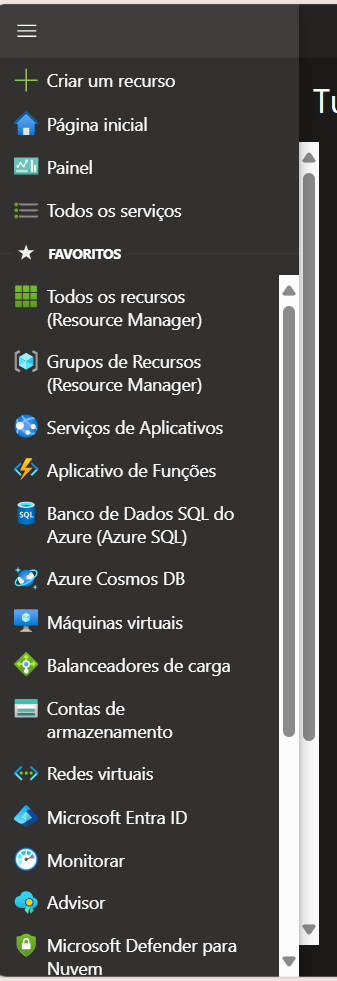
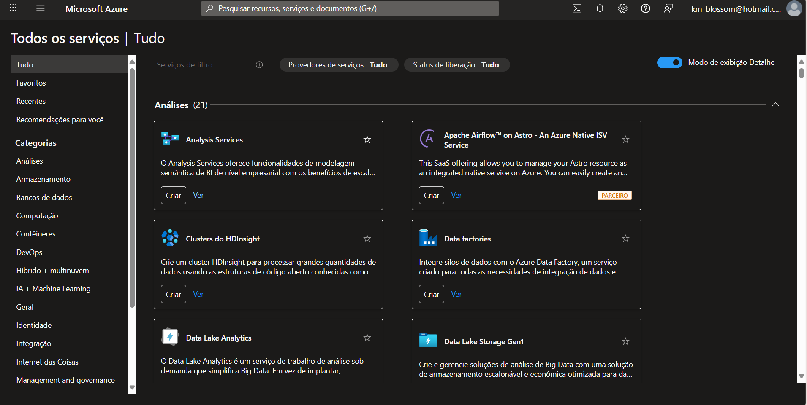

# Laboratório Microsoft Azure
### Localizando Serviços por Categoria

Neste laboratório foi possível aprender sobre a localização dos principais itens do portal da Azure, assim como o personalização do da aparência do portal.

Na tela inicial do portal, é possível acessar um menu lateral onde fica fácil acesso à estrutura do portal.

Ao clicar na opção de Todos os Serviços, aparecem as opções dos serviços disponibilizados, separados por categorias, para o fácil acesso do usuário a recursos específicos.

Em resumo, o laboratório mostrou o visual das ferramentas já mencionadas durante as aulas teóricas, com explicação dos recursos e de termos do portal.

---

⭐ Este repositório tem como objetivo ser um desafio do bootcamp Microsoft - Azure AZ-900 da [DIO](https://web.dio.me/track/microsoft-azure-az-900).